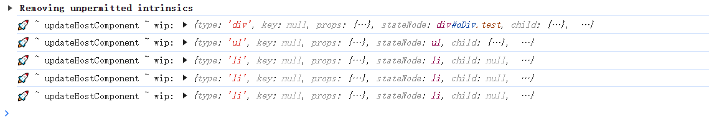
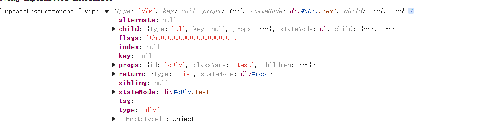
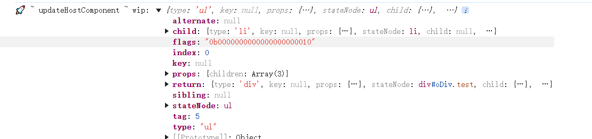
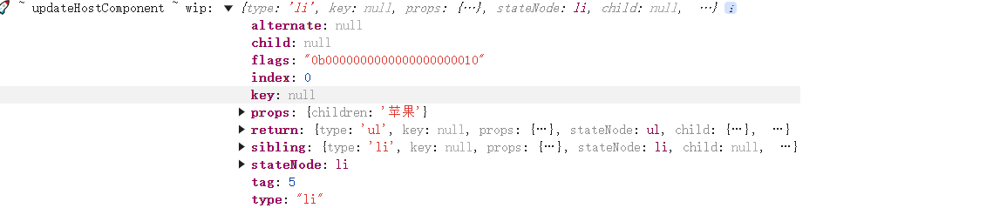

本README主要的作用是引导如何读react-min这个项目，并非具体解释react-min具体流程
# creteFiber 流程
1. 在main.js中我们引入了自己的`ReactDOM` 并执行了`createRoot`方法，根据传入的参数 确认了根`root`为容器。
   调用`render`方法我们传入需要渲染的`vnode`
2. 进入的`render`方法里面，可以看到`render` 是`createRoot`返回的一个对象`ReactDOMRoot`里面的方法，`render`方法执行
   调用的是`updateContainer`方法，这个方法调用`createFiber`，创建一个虚拟节点
3. 在`reconciler/ReactFiber`文件中可以看到如何具体创建的一个`vnode`, 这里简要说一下就是创建了一个对象`fiber`, 在这个对象上
   挂在一些属性，因为`type`的不同，所以给不同的`type`打`tag`，然后输出fiber这个节点。
到此我们就完成一个fiber的创建

# work loop流程
这里主要是说一下`scheduleUpdateOnFiber`方法是最终抛出来的，在`react-dom/ReactDom`中的`updateContainer`方法中执行，具体逻辑在
`reconciler/ReactFiberWorkLoop`中

# beginWork
在这一部分创建了两个文件`ReactReconciler.js`和`ReactFiberBeginWork.js`两个文件，在这个文件中主要是处理根据不同的tag 处理不同的wip，`ReactReconciler.js`文件主要就是储存这些不同的方法
在`utils`文件中新增了 `updateNode`的方法，这个方法对真实的dom节点进行处理。

# 生成fiber链表
从下面这个图片就可以看到最终的结构，在`ReactChildFiber.js`中的`reconcileChildren`方法中组成了fiber链表，从`div`一直到里面的`li`组成一个链表

从下面的这张图我们能够看出来，div没有兄弟元素sibling为null, 父元素为root，子元素为ui

从下面的这张图我们可以看到，ul的子元素是li，父元素是div

从下面的这张图我们可以看到，li的父元素是ul sibling元素是li

# 完成标签的初次渲染
这块主要是新增了`ReactFiberCommitWork`文件，主要把生成的fiber转换成DOM节点。效果如下图

这个文件包含三个方法`getParentDOM`,`commitNode`, `commitWorker`

## getParentDOM
获取当前的fiber节点的父对象，注意里面有一个判断
为什么要获取？因为我们要在里面插入vnode

## commitNode
执行dom操作

## commitWorker
最终抛出来的方法，在`ReactFiberWorkLoop`文件中的`perfromUintOfWork`方法中执行。
这个方法干三件事
- 提交自己
- 提交自己的子节点
- 提交自己的兄弟节点
